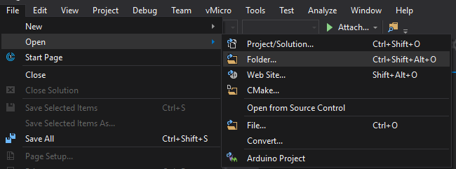
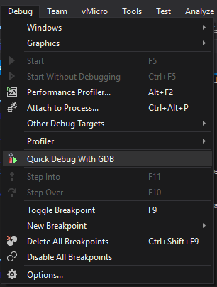
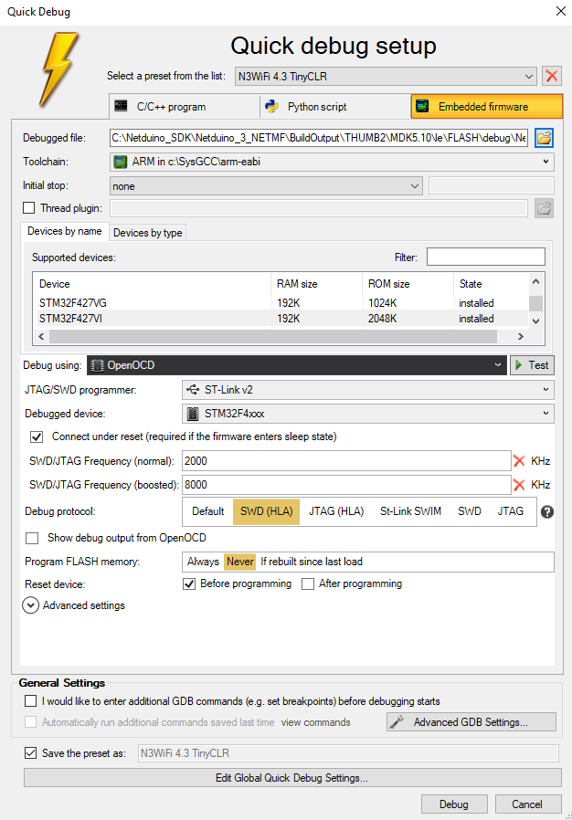

# Native Debugging

The firmware for the Netduino family of processors is split into two components:

* Native code written in C/C++ with a small amount of assembler
* Managed code written in C#

This section covers debugging the native code deployed to the Netduino.

## Debug Interface

The Netduino board offer two interfaces for debugging, the USB port on the board and a JTAG interface.  The JTAG interface will be used for native firmware debugging.  Adding a header to the board is covered in the [ST-Link Connection Guide](../STLinkConnection/).

## Deploy Debug Firmware

A debug version of the Netduino firmware should be deployed to the board in order to allow debugging.

The Netduino firmware should be built using the MSBuild project in the appropriate board directory.  The firmware requires debug information added to the compiled firmware.  The [firmware build guide](../FirmwareBuildGuide) discusses how to build the firmware and flash the new firmware to the Netduino board.

At this point the firmware can be debugged using Visual Studio.

## Debugging Using VisualGDB

[VisualGDB](https://visualgdb.com/) is a Visual Studio (Windows only) extension for embedded development.  It supports a number of different microcontrollers and debug interfaces including the STM32 family of boards and ST-Link interfaces.

VisualGDB also supports Quick Debugging, a feature that allows Visual Studio to connect to a board using a binary compiled using a third party compiler such as GCC.  This feature is in the _Custom_ version of VisualGDB.

VisualGDB is available on a 30-day free trial.

### Open the Project Directory

The first step is to open the Netduino SDK project directory on your machine.  This can be done using the _Open Directory_ option in the _File_ menu:

Be sure to select the directory containing the sources for the board being debugged i.e. Netduino_3_NETMF or Netduino_2_and_3_NETMF.

### Start Quick Debug

_Quick Debug_ can be found on the _Debug_ menu:

This will open a dialog allowing the selection of the binary file to be debugged along the with various options for the hardware debugger being used:

* _Debugged file_ should be set to the axf file generated by the firmware build process.  This may need the file filter to be changed from _*.elf_ to _*.*_
* Select the correct chip type from the list of supported devices
* _Debug using_ should be set to _OpenOCD_
* Select your preferred programmer from the list possible programmers
* Set the generic device from the list provided
* Set the debug protocol to _SWD (HLA)_ when using the ST-Link.  JTAG can be used when other programmers are available
* Set _Program FLASH memory_ to _Never_ if the code is being deployed using STM32 Cube Programmer

Once complete the above settings can be saved to a preset to making loading quicker for future debug sessions.