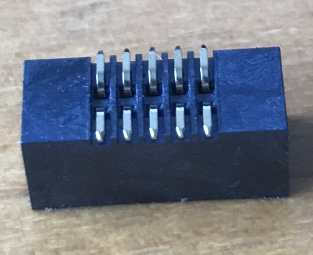
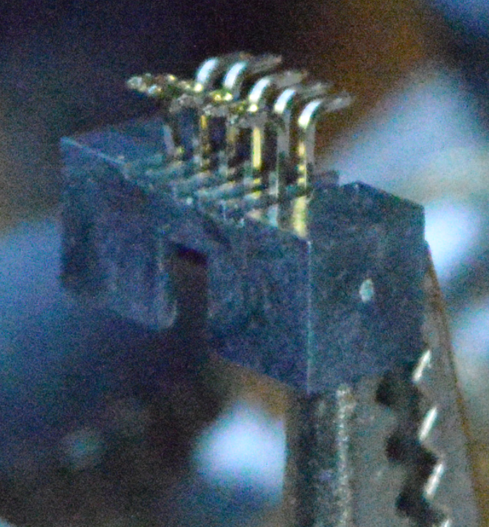
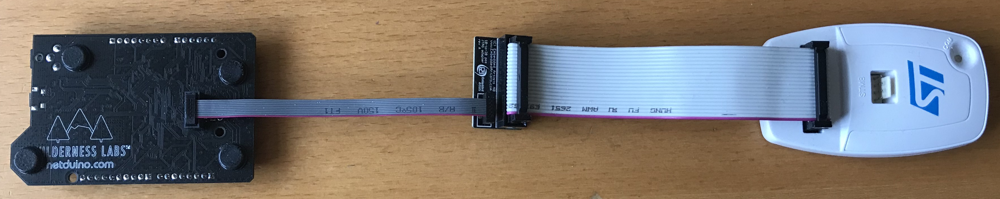

# Connecting ST-Link for Native Firmware Debugging

All of the Netduino boards contain solder pads allowing access to the JTAG / SWD interface on the STM32 microcontrollers.  This interface allows the developer to attach a debugging interface such as the ST-Link or Segger J-Link units to the microcontroller.  The debug interface can now be used to upload new firmware and debug code deployed to the microcontroller.

## Adding a Socket

The image below shows the solder pads for the JTAG interface on the Netduino 3 WiFi board:

All of the boards also have a small marker on the connector or silk screen indicating the location of pin 1.  In the image above, pin 1 is indicated by the small triangle.

The most convenient way of connecting the debug interface to the board is to solder a socket to the board.  This is relatively easy on the Netduino PLus 2 as the connection point is a plated through hole connection.  It is more difficult with the Netduino 3 Ethernet and the Netduino 3 WiFi as the solder pads are designed for use with surface mount sockets.

The solder pads on all of the boards are designed for a 2 x 5 pin IDC socket with a 1.27mm pitch.  These are readily available through most major suppliers such as DigiKey etc.  Ensure that you order the correct part, through hole or surface mount.

Adding the IDC socket to the Netduino Plus 2 is relatively simple as it is a through hole component.  It is made slightly tricky as the pins are on a 1.27mm pit compared to the 2.54mm pitch that is more common for through hole components.

The Netduino 3 Ethernet and Netduino 3 WiFi are a little more difficult as the socket is a surface mount part:

It is clear from the image above that the flat part of the pin is nearly flush with the bottom of the socket shroud.

The slot on the shroud of the IDC socket indicates the location of pin 1.  The socket should be place with the slot in the shroud on the same side as the pin 1 marker.

### Flush Pins

It is possible, although difficult to apply a little solder paste to ach of the pads on the Netduino and then place the socket onto the solder paste.  A soldering iron or a heat gun can then be used to heat the pins and solder the socket to the board.

### Extended Pins

It is possible with a little pressure to push the 10 pins out through the shroud to give more space between the shroud and the flat base of the pins.  Use a flat metal object that is capable of fitting inside the shroud.  Gently push on two or more pins, the pins should start to move out through the bottom of the plastic shroud.  Continuing with the remaining pins should result in something like the following:

Next place the flat edge of the pins a flat surface and apply a light pressure to ensure that all of the pins are level.  This helps to ensure that the pins are at the same level when soldering.

The socket is now ready for soldering onto the Netduino.

Once complete the socket will look similar to the following:

The shroud can now be pushed down towards the Netduino and the ST-Link (or equivalent) connected to the board:

